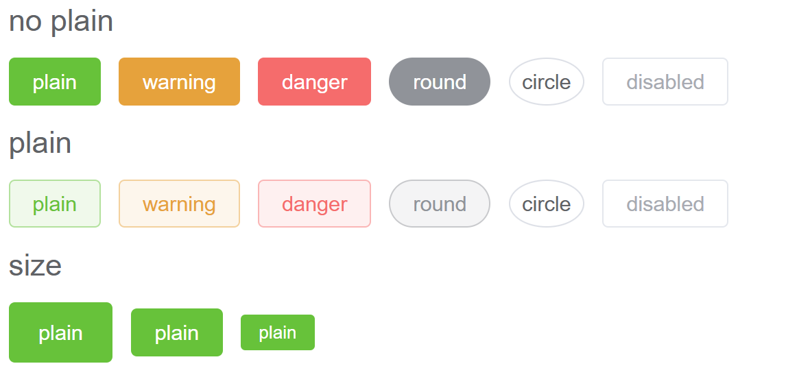
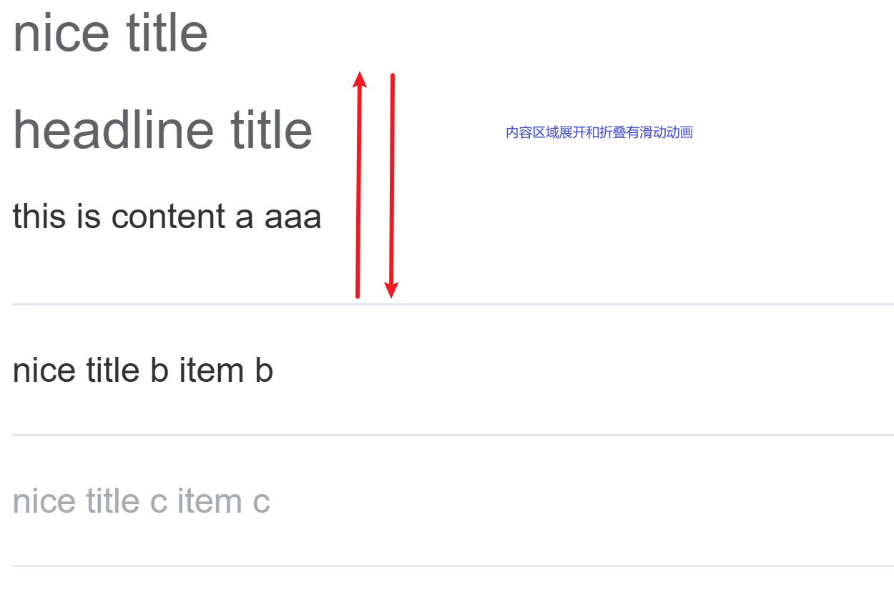
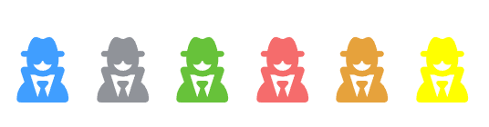
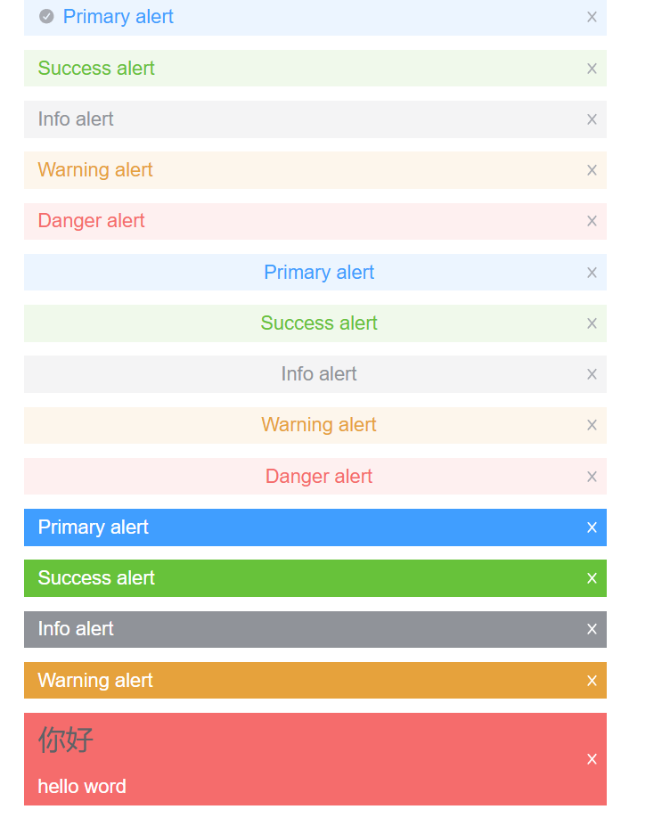

# 封装button组件

## 示例图



## 参数声明

先在`type.ts`中定义好封装的组件需要接受的数据的类型，既要有自己封装的新的属性，也要兼容原生的属性`autofocus`等

- ```ts
  export interface ButtonProps{
      type?: ButtonType;
      size?: ButtonSize,
      plain?:boolean, //样式展示不同的形式，有背景填充和无背景填充
      round?: boolean,//圆角
      circle?:boolean,//圆形按钮
      disabled?:boolean,//禁用
      nativeType?:ButtonNative,
      autofocus?:boolean,
  }
  ```

## 实例暴露

由于封装的组件是给其他人使用，使用需要让其他人能够拿到里面`原始的组件实例`,因此需要对外暴露DOM对象，并且需要对暴露的对象进行定义，确保在外面能够通过`.value._ref`直接获取DOM对象，而不是Proxy代理

- ```ts
  let _ref = ref<HTMLButtonElement>();
  defineExpose({
      ref:_ref
  })
  
  // 按钮的类型
  export interface ButtonInstance{
      ref:HTMLButtonElement,
  }
  ```

## 添加样式

最后一步就是写样式,上面是使用封装好的组件，下面是组件内部的实现

- ```html
  <Button type = "success" plain>plain</Button>
  
  <button
  class="wm-button"
  :class="{
      [`wm-button--${type}`]:type,
      [`wm-button--${size}`]:size,
      'is-plain':plain,
      'is-circle':circle,
      'is-round':round,
      'is-disabled':disabled,
  }"
  :disabled = "disabled"
  :autofocus = "autofocus"
  :type = "nativeType"
  ref="_ref"
  >
  <span>
      <!-- 让组件中的内容，在这里呈现 -->
      <slot></slot>
  </span>
  </button>
  ```

- 通过defindeProps接受参数，对不同的class进行赋值

- 最后在css中使用，**主要是利用了css中后写的样式会对先写的样式进行覆盖的原理**

  - ```css
    /* 先定义基础的属性 */
    .wm-button {
        /* 按钮字体粗细：复用全局的主字体粗细变量 */
        --wm-button-font-weight: var(--wm-font-weight-primary);
    }
    
    /* 然后定义行为，即真正的样式 */
    .wm-button {
        font-weight: var(--wm-button-font-weight);
    }
    
    /* 
    	最后当要通过行为去修改样式的时候，就可以直接修改需要修改的属性即可
    
    */
    &:focus {
        color: var(--wm-button-hover-text-color);
        border-color: var(--wm-button-hover-border-color);
        background-color: var(--wm-button-hover-bg-color);
        outline: none;    
    }
    ```

## postcss

最后就是利用三个插件对css进行for循环修改：`postcss-each`,`postcss-color-mix`,`postcss-for`

- ```scss
  /* 利用@each对不同的buttonType进行遍历，再进行颜色的选择 */
  @each $val in primary,success,warning,info,danger {
    .wm-button--$(val) {
      --wm-button-text-color: var(--wm-color-white);
      --wm-button-bg-color: var(--wm-color-$(val));
      --wm-button-border-color: var(--wm-color-$(val));
      --wm-button-outline-color: var(--wm-color-$(val)-light-5);
      
      --wm-button-active-color: var(--wm-color-$(val)-dark-2);
  
      --wm-button-hover-text-color: var(--wm-color-white);
      --wm-button-hover-bg-color: var(--wm-color-$(val)-light-3);
      --wm-button-hover-border-color: var(--wm-color-$(val)-light-3);
  
      --wm-button-active-bg-color: var(--wm-color-$(val)-dark-2);
      --wm-button-active-border-color: var(--wm-color-$(val)-dark-2);
  
      --wm-button-disabled-text-color: var(--wm-color-white);
      --wm-button-disabled-bg-color: var(--wm-color-$(val)-light-5);
      --wm-button-disabled-border-color: var(--wm-color-$(val)-light-5);
    }
    .wm-button--$(val).is-plain {
      --wm-button-text-color: var(--wm-color-$(val));
      --wm-button-bg-color: var(--wm-color-$(val)-light-9);
      --wm-button-border-color: var(--wm-color-$(val)-light-5);
      --wm-button-hover-text-color: var(--wm-color-white);
      --wm-button-hover-bg-color: var(--wm-color-$(val));
      --wm-button-hover-border-color: var(--wm-color-$(val));
      --wm-button-active-text-color: var(--wm-color-white);
    }
  }
  ```

- ```scss
  /* 这里尝试使用@each 语法去生成颜色 */
  @each $val,$color in (primary,success),(#409eff,#67c23a){
      --wm-color-1-$(val):$(color);
      @for $i from 3 to 9 by 2{ 
          --wm-color-1-$(val)-light-$(i):mix(#fff,$(color),.$(i));
      }
      --wm-color-1-$(val)-light-8: mix(#fff,$(color),.8);
      --wm-color-1-$(val)-dark-2: mix(#000,$(color),.2);
  }
  
  /* 效果等价于 */
  --wm-color-primary: #409eff;
  --wm-color-primary-light-3: rgb(121, 187, 255);
  --wm-color-primary-light-5: rgb(160, 207, 255);
  --wm-color-primary-light-7: rgb(198, 226, 255);
  --wm-color-primary-light-8: rgb(217, 236, 255);
  --wm-color-primary-light-9: rgb(236, 245, 255);
  --wm-color-primary-dark-2: rgb(51, 126, 204);
  
  --wm-color-success: #67c23a;
  --wm-color-success-light-3: rgb(149, 212, 117);
  --wm-color-success-light-5: rgb(179, 225, 157);
  --wm-color-success-light-7: rgb(209, 237, 196);
  --wm-color-success-light-8: rgb(225, 243, 216);
  --wm-color-success-light-9: rgb(240, 249, 235);
  --wm-color-success-dark-2: rgb(82, 155, 46);
  --wm-color-warning: #e6a23c;
  ```

# Collapse

## 示例图



## 参数传递

> 当父组件中使用的是插槽来渲染子组件，就无法使用Props进行参数的传递，所以使用`provide/inject`

首先在`type.ts`中定义好需要传递的类型，当然，同时需要使用Symbol来生成唯一的key，并且使用InjectionKey来指定传输数据的类型，然后就可以使用provide直接传递

- ```ts
  //type.ts
  // 定义Collapse传入CollapseItem的数据
  export interface CollapseContext{
      activeName:Ref<NameType[]>,
      handleItemClick:(item:NameType)=>void,
  } 
  
  // 由于需要使用provide给后代传递数据，所以需要独一无二的key，这里用Symbol
  export const collapsecontextkey = Symbol("CollapseContext") as InjectionKey<CollapseContext>;
  
  //父组件 传递
  // 给后代组件传递
  provide(collapsecontextkey,{
      activeName:activeName,
      handleItemClick:handleItemClick,
  });
  
  //子组件 接受
  const collapsecontext = inject(collapsecontextkey);
  ```

- 主要就是两件事情：

  1. 判断当前的组件是否是展开状态，是就展示，不是就不展示：对于`content`
  2. 修改包含展开组件的数组，有就删除name，没有就加入name

## 双向绑定

> 自定义的v-model

在父组件中使用`v-model = "modelValue"`

```ts
//父组件，利用双向绑定，也实现了组件外赋初始值的功能
const modelValue = ref<NameType[]>(["a","b",'c']);

//在子组件中接受参数和事件
const props = defineProps<CollapseProps>();
const emits = defineEmits<CollapesEmits>();

//在vue中，如果没有指定事件，那么会自动命名为update:modelValue
emits("update:modelValue",activeName.value);
//当在子组件中触发事件，把值传给父组件，然后又通过父子传值，把新值传回来，就实现了双向绑定
```

> 新的问题，activeName只在初始赋值，如果由于异步，props.modelValue发生变化，那么activeName不会修改

```ts
// 用于存储需要展开的对象
const activeName = ref<NameType[]>(props.modelValue);
```

所以引入watch进行监听

```ts
// 用于存储需要展开的对象
const activeName = ref<NameType[]>(props.modelValue);
// 监听props.modelValue，防止在外部发生异步变化
watch(()=>props.modelValue,(newValue)=>{
    // 对于外部传过来的数据，必须用函数式返回属性
    activeName.value = newValue
})
```

此时，在外部定时器异步修改的modelValue在组件内部也能反映接收。

## 动画效果


> 添加动画效果，目前实现的是内容区域的展开与折叠是生硬的，需要加上滑动的动画效果，使用`<Transition></Transition>`标签实现。

```css
.fade-enter-from,
.fade-leave-to{
    opacity: 0;
}
.fade-enter-active,
.fade-leave-active{
    /* transition: 要过渡的属性 持续时间 速度曲线; */
    transition: opacity 1s ease-in-out;
}
.fade-enter-to,
.fade-leave-from{
    opacity: 1;
}
```

上面是渐变opacity透明度，很简单，但是滑动需要得出最后的高度，但是内容区域的高度是动态的，所以这里需要**动态的计算高度**

这里使用`el.scrollHeight`获取元素的高度Transition标签对应的生命周期钩子

```ts
//使用v-on，会自动把beforeEnter映射为before-enter，从而一一对应起来
//一下是
const transitionEvents : Record<string,(el:HTMLElement)=>void> = {
    // 在元素被插入到 DOM 之前被调用
    beforeEnter(el){
        el.style.height = "0px"
    },
    
    //过渡结束
    enter(el){
        el.style.height = `${el.scrollHeight}px`
    },
    
    //当进入过渡完成时调用
    afterEnter(el){
        el.style.height = ""
    },
    
    //离开前
    beforeLeave(el){
        el.style.height = `${el.scrollHeight}px`
    },
    //离开后
    Leave(el){
        el.style.height = "0px"
    },
    
    //离开完成
    afterLeave(el){
        el.style.height = ""
    }
}
```

两个after是为了清空动画的残留，防止当内容区又变化的时候，高度限制死了


> 但是如果有`padding-bottom: 25px;`的时候，这个padding会很突兀的出现，而不是随着height变化而变化，所以这里将其用一层div包裹起来，此时子元素的height和padding都会被算为父元素的height，但是又会出现新的问题，此时子元素会先显示出完整的内容，动画正在慢慢的变化，此时给父元素一个`el.style.overflow = "hidden"`，对超出的部分进行隐藏即可，当然记得after的时候清空动画的残留。

# Icon

## 实例图



前面五个是根据之前的五个按钮类型进行配置的，最后的黄色是自定义的颜色，保证使用者能够自定义颜色。

## 组件封装

对于图标组件，其实就是在其他组件库的基础上封装自己的组件图标，下面的`FontAwesomeIcon`就是开源的组件库

```ts
<i class="wm-icon"
    :class="{
        [`wm-icon--${type}`]:type,
        [`wm-icon--${color}`]:color,
    }"
    :style="ourColor"
    >
    <FontAwesomeIcon v-bind="filterProps"></FontAwesomeIcon>
</i>
```

我们是在这个组件库的基础上进行二次开发的，所以开发的过程中需要兼容原生的属性，但是又要加入我们自定义的属性，保证和自己的组件库中的其他组件适配。

```ts
import type{ FontAwesomeIconProps } from '@fortawesome/vue-fontawesome';

export interface IconProps extends FontAwesomeIconProps{ 
    type?: "primary" | "success" | "warning" | "danger" | "info",
    color?:string,
}
```

最后就是和Collapse一样的问题，接受的参数来自于外部，所以需要通过监视属性或者计算属性，更新参数

```ts
// 现在的问题是，我在IconProps中添加了两个新的属性，是给外层的，而不是给内层的
const props = defineProps<IconProps>();
// 和Collapse一样的问题，外部传入的props只会在初始化的时候赋值，所以需要监视,这里也可以使用计算属性
let filterProps = computed(()=>omit(props,["type","color"]));
```

## 给其他组件添加图标

这里是给button组件和collapse组件添加图标

### button

其实就是加入两个新的属性

```ts
icon?:string, //想要什么图标就传进来
loading?:boolean,
```

然后再span之前添加两个icon组件即可，第一个为loading，当loading为true不显示，且启用disabled，第二个是loading为false显示对应的icon组件

### collapse

这里主要是在header标题的右边添加一个向右的`>`,当内容展开的时候，自动旋转90度，折叠就旋转回去

# Alert

## 示例图



## 组件封装

这是完全自己封装的一个组件，主要就是展示和关闭div，可以传入不同的参数

```ts
export interface AlertProps{
    title?:string,
    type?:"primary" | "success" | "warning" | "danger" | "info",
    effect?:"light" | "dark",
    closable?:boolean,
    center?:boolean,
}
```

且title是使用slot的，可以传入复杂的形式的文字，是否关闭（这里暂时没有使用），以及是亮色和暗色，就是颜色的深浅，文字是否居中，并且组件返回了close事件，让使用者在外面就能调用，可以实现定时关闭。

```ts
let alertRef = ref<Instance>();
setTimeout(()=>{
    alertRef.value?.close();
},3000);
```

> **当然，还有之前的图标，但是现在的问题是，我不太知道怎么根据不同的type去赋值不一样的图标组件，目前支持的还是自己去传入icon而不是固定的**
